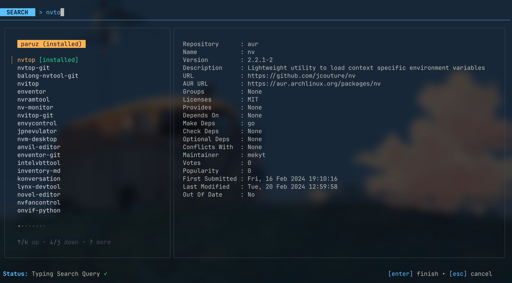

# Paruz



Paruz is a fast, Terminal User Interface (TUI) for Arch Linux that acts as a visual wrapper for the `paru` AUR helper.

It allows you to:
- **Search:** Quickly search your local pacman sync databases and AUR (via paru -Qs / paru -Ss).
- **Inspect:** View rich package information (`paru -Si`).
- **Install:** Trigger installations directly from the UI, with standard output and prompts embedded into the TUI.
- **Mirrors:** Update your pacman mirrorlist using `rate-mirrors`.

## Installation

Ensure you have `paru` (or `yay`) and (optionally) `rate-mirrors` installed on your system.

### Quick Install (Linux)

Install the latest pre-built binary to `/usr/local/bin`:

```bash
curl -sL https://raw.githubusercontent.com/vyogami/aura/main/install.sh | sudo sh
```

### Build from Source

```bash
git clone https://github.com/vyogami/aura
cd aura
go build -o paruz ./cmd/paruz
```

## Usage

Run the compiled binary:
```bash
./paruz
```

### Keybindings
- **`/`**: Start filtering/searching packages
- **`Enter`**: Install the selected package
- **`u`**: Update mirrorlist (requires `rate-mirrors` and `sudo`)
- **`r`**: Refresh package cache
- **`,`**: Open settings menu
- **`Esc`**: Exit terminal execution or clear search
- **`q`**: Quit the application

## Configuration

Paruz stores its configuration in `~/.config/paruz/config.toml`.

### `config.toml`
```toml
aur_helper = "paru"      # paru or yay
mirror_helper = "rate-mirrors" # rate-mirrors or reflector
theme = "ayu-dark"       # default theme name
```

### Custom Themes
You can add your own themes by creating `~/.config/paruz/themes.toml`:

```toml
[themes.my-cool-theme]
title_bg = "#ff00ff"
title_fg = "#ffffff"
border = "#6272a4"
info_title = "#ff79c6"
info_key = "#8be9fd"
error = "#ff5555"
status_bar = "#f8f8f2"
```

After adding a theme to `themes.toml`, it will appear in the settings menu (press `,`).

## Technical Details

Paruz is built in Go using the incredible [Charmbracelet](https://charm.sh/) ecosystem (`bubbletea`, `bubbles`, `lipgloss`). It integrates with `creack/pty` to provide a pseudo-terminal specifically for rendering `paru` output inside the TUI viewport while correctly forwarding user inputs (like typing `y` for `PKGBUILD` reviews).

## Inspiration

This project is inspired by the original [paruz](https://github.com/joehillen/paruz) by Joe Hillen. However, that project has been abandoned and its source code is no longer available on GitHub. 

While the original `paruz` was a simple script that used `fzf` to provide a selection interface for `paru`, this version of **Paruz** is a complete, standalone TUI built from the ground up using **Bubble Tea**. It provides a richer, more interactive experience with features like live package inspection, system-wide mirror updates, and dynamic theming.
